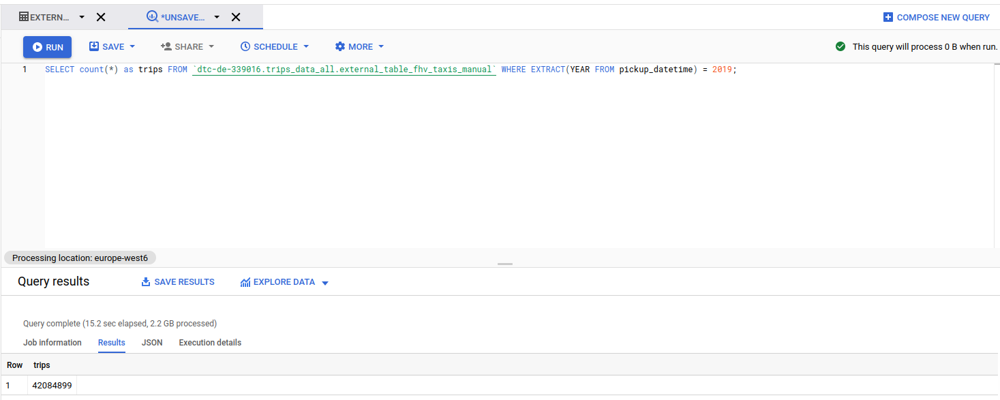
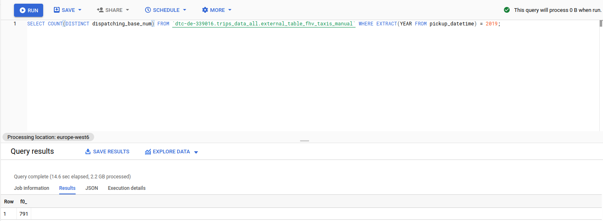
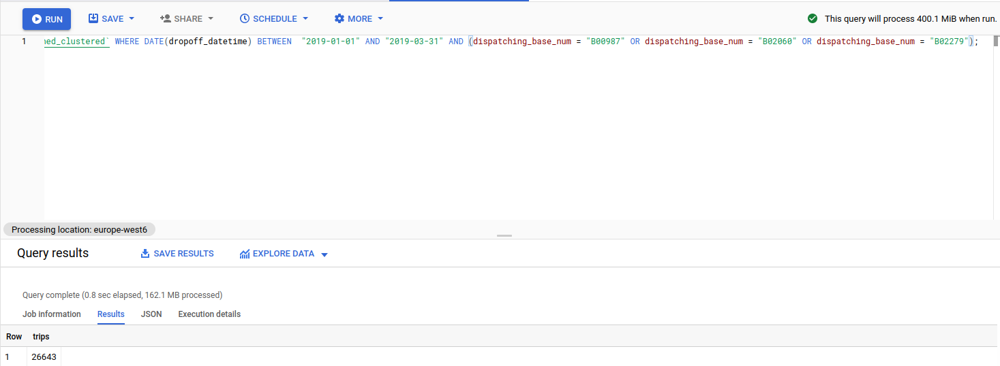

# Homework week 3

Question 1: What is count for fhv vehicles data for year 2019?

Question 2: How many distinct dispatching_base_num we have in fhv for 2019?

Question 3: Best strategy to optimise if query always filter by dropoff_datetime and order by dispatching_base_num?

Answer: Partition by dropoff_datetime and cluster by dispatching_base_num

Question 4: What is the count, estimated and actual data processed for query which counts trip between 2019/01/01 and 2019/03/31 for dispatching_base_num B00987, B02060, B02279?

Question 5: What will be the best partitioning or clustering strategy when filtering on dispatching_base_num and SR_Flag?

Answer: Cluster by dispatching_base_num and SR_Flag

Question 6: What improvements can be seen by partitioning and clustering for data size less than 1 GB?

Answer: Can be worse due to metadata

Question 7: In which format does BigQuery save data?

Answer: Columnar