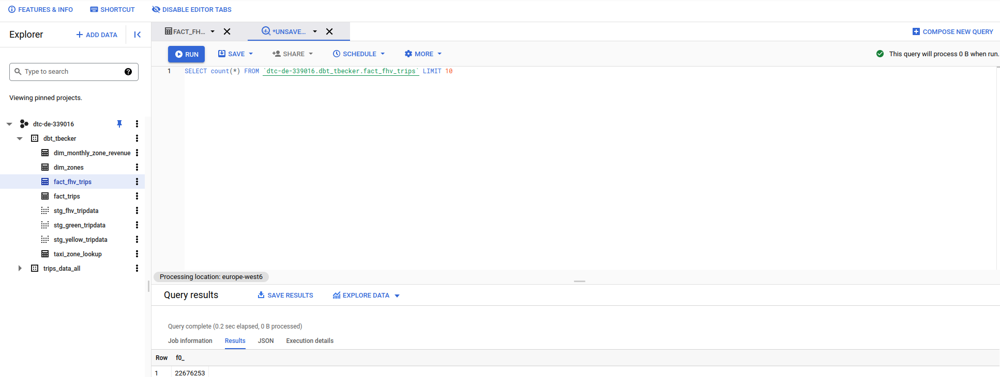

# Homework week 4

Question 1: Question 1: What is the count of records in the model fact_trips after running all models with the test run variable disabled and filtering for 2019 and 2020 data only (pickup datetime)?

Question 2: Question 2: What is the distribution between service type filtering by years 2019 and 2020 data as done in the videos . (Yellow/Green)?

Question 3: Question 3: What is the count of records in the model stg_fhv_tripdata after running all models with the test run variable disabled ?

Question 4: Question 4: What is the count of records in the model fact_fhv_trips after running all dependencies with the test run variable disabled?

Question 5: Question 5: What is the month with the biggest amount of rides after building a tile for the fact_fhv_trips table?
